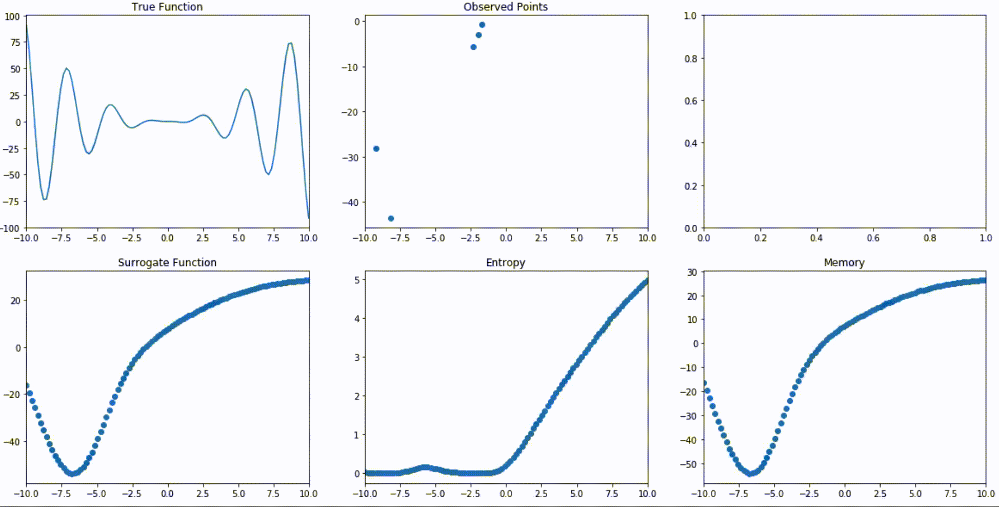

Surrogate Optimization Method using NN as Surrogate
---

* Tries to model underlying function using a NN
* Tries to model uncertanty of the surrogate function by using a memory NN to predict the output of the surrogate

#### Example
```python
from nnopt.nnopt import Optimizer

def black_box_function(x, y):
    """Function with unknown internals we wish to maximize.

    This is just serving as an example, for all intents and
    purposes think of the internals of this function, i.e.: the process
    which generates its output values, as unknown.
    """
    return -x ** 2 - (y - 1) ** 2 + 1

best, target = Nopt.run(random=10, optimization=40, fitting=100, verbose=True)
print("Best", best, "target", target)

```

see 
- [bayes opt comparison](https://github.com/JonasRSV/NNopt/blob/master/nnopt/example/bayes_vs_nnopt.ipynb)
- [interactive sort of..](https://github.com/JonasRSV/NNopt/blob/master/nnopt/example/NNoptInteractive.ipynb)


#### Demo


